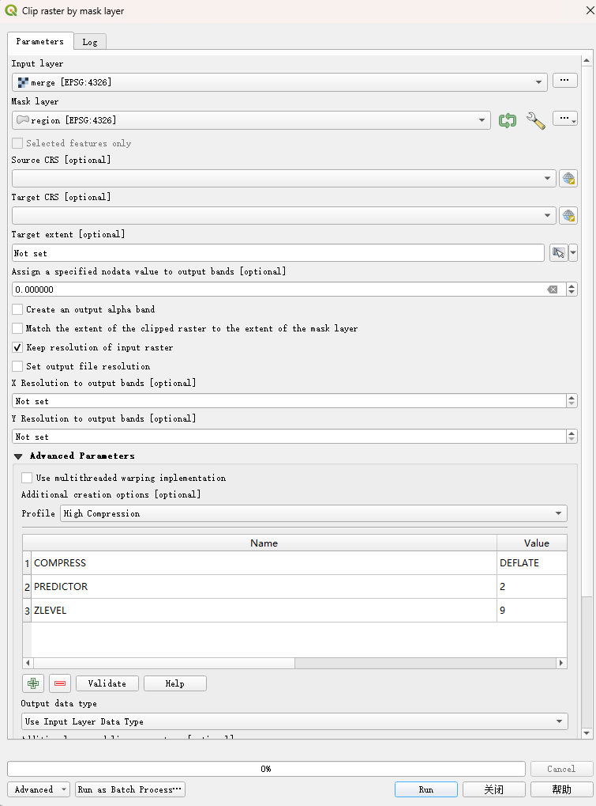

# QGIS_CaseStudy

## Overview

This case dirived from [Link](https://www.qgistutorials.com/en/docs/3/raster_mosaicing_and_clipping.html). This tutorial explores basic techniques for working with rasters in QGIS such as mosaicing and subsetting.

## Data

The Digital Elevation Model(DEM) data is derived from [SRTM30m](https://dwtkns.com/srtm30m/). The shapefile for administrative boundary is derived from [NATURALEARTH](https://www.naturalearthdata.com/).

## (Simplified) Workflow

### 0. Preprocess

Get raster data from .zip and add them into QGIS project.

> You can either unzip them manually or call a unzip tool in your gis-agent workflow.

### 1. Merge

> GDAL ‣ Raster miscellaneous ‣ Merge tool

Merge several raster layers into a singular layer.

### 2. Extract by Attribute

> Vector selection ‣ Extract by Attribute

### 3. Clip by Mask Layer

> GDAL ‣ Raster extraction ‣ Clip raster by mask layer tool

Key Notes:

1. Set "High Compression" in the advanced parameters followed preprocess step and set `0` as `NODATA`, otherwise, the result will still be a rectangle region.
2. The raster value indicate the elevation of this region. It is notable that some of the points are `0m above sea level`, which is also considered as `NODATA` in this step. This should be fixed by adjust the preprocess step.
